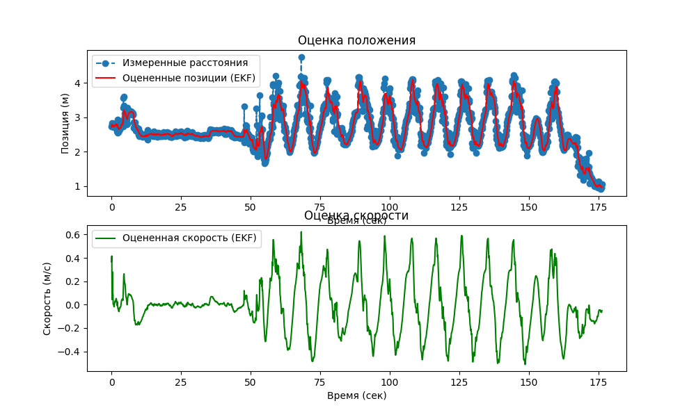

# Линейный фильтр Калмана 

## Установка

```shell
pip install -r requirements.txt 
```

## Запуск

```shell
python main.py
```

## Описание

Данный код применяет фильтр Калмана к данным в папке data.
`main.py` визуализирует и сохранит график в папку data. 

Пример графика:

